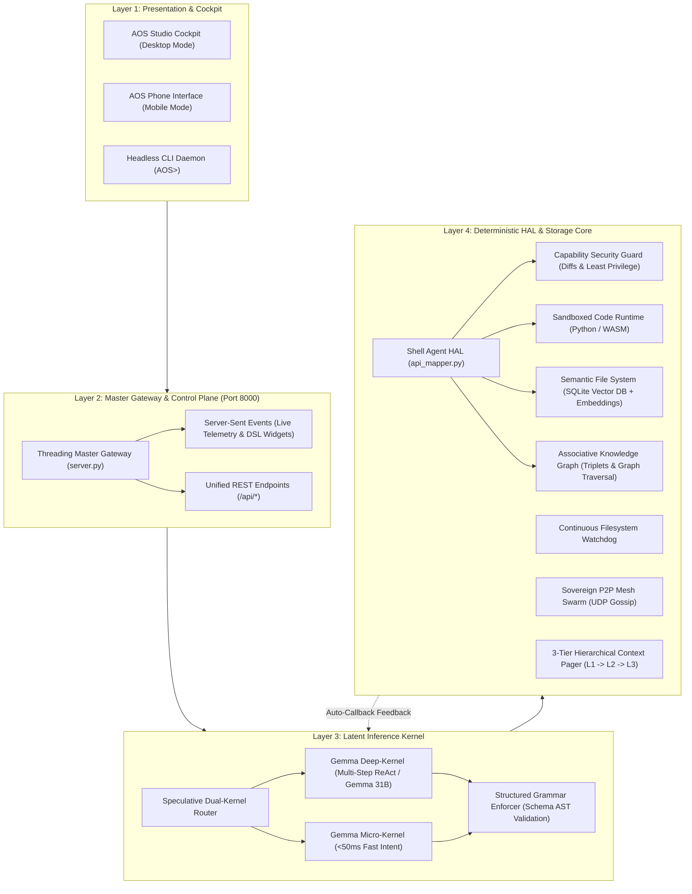

# Agentic Operating System (AOS)

[](LICENSE)
[](https://python.org)
[-purple.svg)](https://ai.google.dev/gemma)
[](docs/triage_matrix.md)
[](docs/explanation/architecture.md)
[](docs/reference/virtual-os.md)

> **A sovereign, local-first agentic computing operating system powered by Google Gemma.**  
> Built for resilient, privacy-preserving, edge-native computing across high-performance workstations and air-gapped devices.

---

## ⚡ The Paradigm Shift

Traditional computing structures personal computing around a rigid **Kernel → Monolithic Application → User** hierarchy. Users must manually juggle separate applications, file pickers, and context silos.

The **Agentic Operating System (AOS)** transforms this into an **Inference Kernel → Hardware Abstraction Layer → Agentic Intent** architecture. An open-weights foundation model daemon continuously evaluates user intent in natural language, automatically decomposing complex requests, verifying security boundaries, and allocating localized system resources at the edge.



---

## 🚀 Key Innovations & Architectural Pillars

| Pillar | Technical Implementation | Capability & Benefit |
| :--- | :--- | :--- |
| **Speculative Dual-Kernel** | `aos_kernel/dual_kernel.py` | Routes routine file/memory operations to `GemmaMicroKernel` for **sub-50ms** dispatch; speculatively escalates complex reasoning to `GemmaDeepKernel`. |
| **Grammar Schema Enforcer** | `aos_kernel/structured_grammar.py` | AST and regex-based schema repairing that mathematically eliminates JSON parse errors and malformed output. |
| **Quantized Edge Engine** | `aos_kernel/quantized_engine.py` | Unified abstraction supporting 4-bit / 8-bit GGUF, `llama.cpp`, and PyTorch hardware targets (NPU, Vulkan, CUDA). |
| **3-Tier Context Memory Pager** | `aos_kernel/context_manager.py` | Manages **L1 Active Context** (8192 token limit), auto-evicts to **L2 Episodic Memory**, and archives to **L3 Vector DB** with automatic `page_fault()` recovery. |
| **Zero-Copy Semantic FS** | `semantic_fs/vector_store.py` | Embedded SQLite vector database with `LocalTextVectorizer` 128-dim dense embeddings and cosine similarity search. |
| **Associative Knowledge Graph** | `semantic_fs/knowledge_graph.py` | Continuous relational entity-relationship triplet extraction (`Subject - Relation - Object`) for associative natural language queries. |
| **Capability Security Guard** | `mock_os/security.py` | Enforces least privilege: auto-approves sandboxed workspaces while generating unified diff previews and prompting for host filesystem or network operations. |
| **Isolated Code Sandbox** | `mock_os/sandbox.py` | Restricted Python scope and WASM execution runtime with timeout limits and stdout/stderr capture. |
| **Desktop Studio Cockpit** | `generative_ui/web/*` | Full-featured glassmorphic cockpit with 5 operational modules: Terminal & Intents, Semantic Vector FS, Security Approvals, Code Sandbox, and Swarm Telemetry. |
| **Sovereign P2P Mesh Swarm** | `mesh_swarm/p2p_mesh.py` | Decentralized, air-gapped peer discovery and heartbeat gossip over local UDP broadcasts without cloud infrastructure. |

---

## 🛠️ Quickstart

### 1. Installation
```bash
# Clone the repository
git clone https://github.com/MuzikayiseKhuzwayo/gemma4good.git
cd gemma4good

# Create and activate virtual environment
python -m venv venv
# Windows:
.\venv\Scripts\Activate.ps1
# Linux / macOS:
source venv/bin/activate

# Install dependencies
pip install -r requirements.txt
```

### 2. Configure Environment (Optional)
```bash
# Copy example configuration template
copy .env.example .env

# Edit .env to set your GEMINI_API_KEY for Google GenAI cloud acceleration.
# If omitted, AOS automatically boots in offline deterministic edge reasoning mode!
```

### 3. Launch the Studio Cockpit & Master Gateway
```bash
python server.py
```
Open **[http://127.0.0.1:8000](http://127.0.0.1:8000)** in your browser to access the full-featured **AOS Studio Cockpit**.

### 4. Or Run Headless Interactive CLI
```bash
python main.py
```

---

## 📚 Diátaxis Documentation System

All project documentation is strictly governed by the **Diátaxis Documentation Framework**, providing clear, purpose-driven navigation for every persona:

```
                      PRACTICAL / ACTION-ORIENTED
                                 │
           How-To Guides         │         Tutorials
      (Problem-oriented recipes) │  (Learning-oriented onboarding)
                                 │
  ───────────────────────────────┼───────────────────────────────
                                 │
            Reference            │        Explanation
    (Information-oriented specs) │ (Understanding-oriented architecture)
                                 │
                      THEORETICAL / KNOWLEDGE-ORIENTED
```

### 1. 🎓 Tutorials (Learning-Oriented)
* **[Getting Started in 10 Minutes](docs/tutorials/getting-started.md)**: Zero-to-one developer walkthrough, environment setup, and executing your first system intent.
* **[Edge & Local-First Deployment](docs/tutorials/edge-deployment.md)**: Hardware sizing, quantization (4-bit/8-bit GGUF), and air-gapped deployment strategies.

### 2. 📖 How-To Guides (Problem-Oriented)
* **[How to Add a Custom Intent](docs/how-to/add-custom-intent.md)**: Step-by-step recipe to declare a new tool schema, map it in the Shell Agent HAL, and handle execution.
* **[How to Configure Inference Modes](docs/how-to/configure-inference.md)**: Switching between Google GenAI API, local PyTorch models, and offline deterministic mode.
* **[How to Run the Automated Validation Suite](docs/how-to/run-validation-suite.md)**: Executing smoke and intent coverage tests across virtual and host environments.

### 3. 📋 Reference (Information-Oriented)
* **[HTTP Master Gateway REST & SSE API](docs/reference/rest-api.md)**: Complete machine-accurate specs for all 17 REST/SSE endpoints (`/api/intent`, `/api/memory/*`, `/api/graph/*`, `/api/sandbox/*`, `/api/capabilities/*`).
* **[Intent Schemas & Payloads](docs/reference/intent-schemas.md)**: Formal grammar schemas for all abstract intent types and payload contracts.
* **[Configuration & Environment Variables](docs/reference/configuration.md)**: Tuning token thresholds, memory budgets, network ports, and hardware targets.
* **[MockVirtualOS Specification](docs/reference/virtual-os.md)**: In-memory filesystem, network simulator, and state inspection API.

### 4. 🧠 Explanation (Understanding-Oriented)
* **[Architecture & Latent Kernel Paradigm](docs/explanation/architecture.md)**: Deep dive into the theoretical shift from monolithic apps to intent virtualization and the ReAct loop.
* **[Context Budgeting & Memory Tiering](docs/explanation/context-budgeting.md)**: Mathematical models for token budget management, page faults, and 3-tier memory paging.
* **[Strategic Evolution Roadmap](docs/explanation/roadmap.md)**: Detailed breakdown of the 4 completed architectural phases.
* **Architectural Decision Records (ADRs):**
  * **[ADR-001: Gemma 4 as the Foundational Latent Kernel](docs/explanation/adr/ADR-001-gemma-latent-kernel.md)**
  * **[ADR-002: Memory-Safe Virtual OS Sandboxing](docs/explanation/adr/ADR-002-memory-safe-virtual-sandbox.md)**
  * **[ADR-003: Diátaxis Documentation Governance](docs/explanation/adr/ADR-003-diataxis-documentation-governance.md)**

### Governance & Provenance
* **[Documentation Triage Matrix & Drift Ledger](docs/triage_matrix.md)**: Audit record linking all documentation files to exact source code anchors.
* **[Hackathon Competition Archive](docs/archive/hackathon/)**: Historical hackathon sprint plans, presentation writeups, and video transcripts preserved for full provenance.

---

## 🧪 Comprehensive Test & Verification Suite

AOS includes a multi-tier test suite covering edge inference, memory paging, security policies, and UI stream rendering:

```bash
# Comprehensive 4-Phase Roadmap Verification (14 unit tests)
python test_roadmap_phases.py

# End-to-end Virtual OS Smoke Test
python validate.py

# Full Intent Coverage Test across all intent types
python test_all_intents.py
```

---

## ⚖️ License & Provenance

Distributed under the **Apache 2.0 License**. See [LICENSE](LICENSE) for details.  
Originally engineered for the **Google Gemma 4 Good Hackathon** and upgraded into a production-grade Agentic Operating System.
