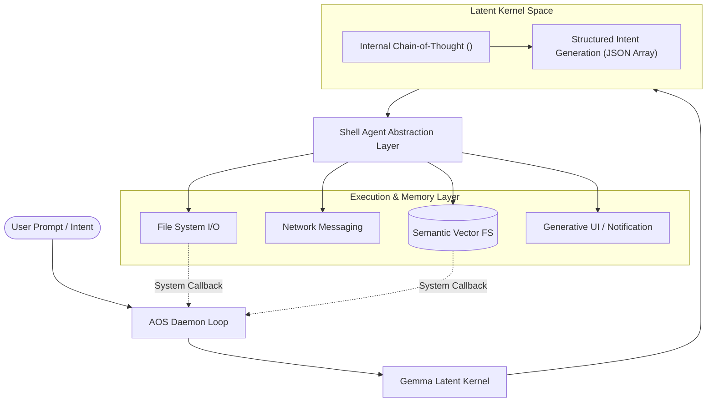

# Explanation: Architecture & the Latent Kernel Paradigm

This document presents the architectural philosophy, conceptual foundations, and runtime mechanics of the Agentic Operating System (AOS).

---

## 1. Paradigm Shift: From Monolithic Applications to Intent Virtualization

For over four decades, personal computing has been governed by the **Kernel-Application-User** hierarchy:

```
Traditional Architecture:
[User] <--> [Static Applications (Spreadsheet, Browser, Mail)] <--> [OS Kernel (Paging, Syscalls)] <--> [Hardware]
```

Under this model:
* The user acts as an imperative operator, manually clicking through graphical menus and juggling application windows.
* Applications are isolated silos with redundant state, heavy binary runtimes, and proprietary data schemas.
* In low-connectivity environments, cloud-dependent SaaS applications become completely unusable.

AOS introduces the **Inference Kernel-Tool Interface-Agentic Intent** model:

```
Agentic OS Architecture:
[User Intent] <--> [Latent Kernel (Gemma 4)] <--> [Shell Agent (Tool Virtualization)] <--> [Sovereign Edge Hardware]
```



In AOS:
1. **The LLM is the Kernel:** The model is not a plugin or a chatbot; it manages scheduling, memory routing, and tool allocation.
2. **Applications are Deprecated:** Capabilities are provided as lightweight, composable tool primitives.
3. **Intent is the Primary Interface:** The user specifies *what* outcome is desired, and the system synthesizes the optimal sequence of actions.

---

## 2. Core Architectural Components

### 2.1. The Latent Kernel (`GemmaLatentKernel`)
Located in [`aos_kernel/inference.py`](https://github.com/MuzikayiseKhuzwayo/gemma4good/blob/main/aos_kernel/inference.py).

The Latent Kernel manages task decomposition in latent token space. Instead of executing deterministic binary code immediately, it projects user intent into structured reasoning tokens. It utilizes `<thought_process>` evaluation to plan multi-step operations before emitting strict JSON-formatted intent payloads.

### 2.2. The Shell Agent (`ShellAgent`)
Located in [`shell_agent/api_mapper.py`](https://github.com/MuzikayiseKhuzwayo/gemma4good/blob/main/shell_agent/api_mapper.py).

The Shell Agent acts as the hardware abstraction layer (HAL). It decouples the AI inference engine from the concrete OS runtime. It translates high-level abstract intents (`WRITE_FILE`, `SEARCH_MEMORY`) into specific system calls, managing path resolution, fallback heuristics, and environment sandboxing.

### 2.3. The Autonomous ReAct Loop (`AOSDaemon`)
Located in [`aos_kernel/daemon.py`](https://github.com/MuzikayiseKhuzwayo/gemma4good/blob/main/aos_kernel/daemon.py).

AOS implements an interactive ReAct (Reason and Act) loop:
1. **Input Interception:** User intent is received and contextualized with recent history.
2. **Intent Synthesis:** Latent Kernel generates the intent array.
3. **Execution & Feedback:** Shell Agent executes non-terminal actions (e.g. `READ_FILE`, `SEARCH_MEMORY`).
4. **Auto-Callback Trigger:** When an action returns data, the daemon automatically synthesizes a `[System Callback]` prompt and feeds the result back into the Latent Kernel without requiring user re-prompting (up to 3 autonomous reasoning turns).
5. **Termination:** Execution terminates when a terminal intent (`NOTIFY_USER`, `ASK_USER_INPUT`) is reached or when feedback ceases.

---

## 3. Failure Modes & Resilience Invariants

* **Missing Context:** When an intent lacks critical parameters, the Latent Kernel emits `ASK_USER_INPUT` rather than hallucinating defaults.
* **Execution Errors:** If a tool call fails, the exception is captured, appended to the execution log, and translated into a concise natural language explanation for the user.
* **Context Overrun:** The `ContextBudgetManager` monitors cumulative token usage and swaps stale context before window saturation occurs.
