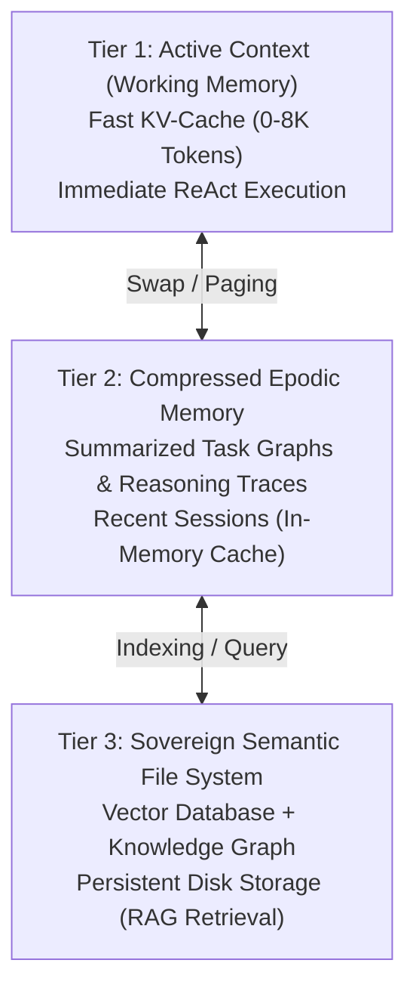

# Explanation: Context Budgeting & Memory Tiering

This document explains the memory management principles of the Agentic Operating System, contrasting traditional OS memory paging with token context budgeting.

---

## 1. Physical Paging vs. Context Window Paging

Traditional operating systems manage physical RAM through Virtual Memory, Paging, and Segmentation:

```
Traditional OS:
[Virtual Address Space] ---> [MMU / Page Tables] ---> [Physical RAM] / [Disk Swap]
```

In an Agentic Operating System, **the context window is the primary memory space**:

```
Agentic OS:
[User Intent + System Prompts] ---> [Context Budget Manager] ---> [Active KV-Cache (L1)] / [Compressed Vector Store (L2/L3)]
```

| Memory Concept | Traditional OS Primitive | Agentic OS Primitive |
| :--- | :--- | :--- |
| **Working Memory** | Physical RAM (Pages) | Active Context Window (Tokens) |
| **Page Fault** | Hardware Trap / Disk Read | Retrieval Augmented Generation (Vector Search) |
| **Swap Space** | Swap Partition / Paging File | Semantic File System / Vector Database |
| **Memory Allocation** | `malloc()` / Heap Allocator | `add_intent(tokens)` / Context Budget |
| **Thrashing** | Excessive Disk Paging | Context Window Overflow / Truncation |

---

## 2. The Context Budget Lifecycle

In [`aos_kernel/context_manager.py`](https://github.com/MuzikayiseKhuzwayo/gemma4good/blob/main/aos_kernel/context_manager.py):

```mermaid
flowchart TD
    Turn[New User Intent or Tool Callback] --> Calc[Compute Estimated Tokens (+150)]
    Calc --> Check{Current Usage + Intent > Max Budget (8192)?}
    Check -- Yes --> Swap["_swap_context(): Evict / Compress Stale Reasoning Chains"]
    Check -- No --> Accum[Accumulate Token Usage]
    Swap --> Reset[Reset Active Usage Counter]
    Reset --> Accum
    Accum --> Dispatch[Dispatch Prompt to Inference Kernel]
```

### Context Eviction & Swapping
When the cumulative token consumption approaches the `max_tokens` threshold:
1. Active context history is evaluated.
2. Older reasoning traces and completed tool outputs are pruned or summarized.
3. Persistent facts, file references, and user preferences are transferred to compressed long-term storage in the Semantic File System.
4. The active working context is reset, maintaining only the most recent interactive turns (`active_context[-5:]`).

---

## 3. Tiered Memory Architecture (Vision)

The long-term vision of AOS establishes a 3-tier hierarchical memory model:


