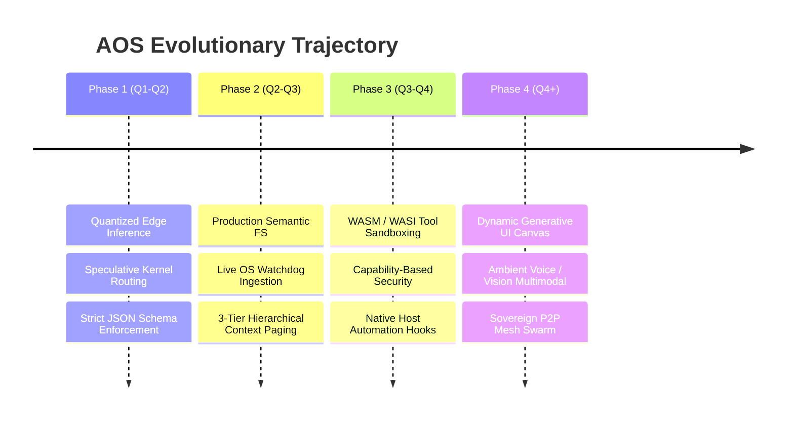

# Explanation: Future Evolution Roadmap for Agentic OS

This document outlines the strategic vision and multi-phase engineering roadmap to evolve the Agentic Operating System (AOS) from a functional hackathon proof-of-concept into a production-grade, local-first sovereign computing platform.

---

## 1. The Strategic Vision

The long-term objective of AOS is to replace monolithic, cloud-dependent personal computing operating systems with an **autonomous, sovereign edge intelligence platform**. 

AOS eliminates the "Luggage Problem"—the redundant multi-gigabyte application stacks that slow down personal computers, consume battery life, leak user telemetry, and become completely useless when offline. By embedding an efficient open-weights foundation model directly as the system daemon, personal computing shifts from manually managing programs to stating intent.



---

## 2. Phase-by-Phase Architectural Roadmap

### Phase 1: Edge Inference Acceleration & Kernel Hardening (Q1–Q2)
*Goal: Enable sub-100ms intent classification and sub-1s tool execution on consumer-grade laptops and edge SBCs.*

1. **Quantized Native Inference Engine:**
   * Transition from naive HuggingFace PyTorch loading to high-performance C++ inference backends (`llama.cpp`, `vLLM`, or Apple `MLX`).
   * Support 4-bit and 8-bit quantized Gemma models (GGUF, AWQ, EXL2) enabling the full 31B reasoning engine to execute comfortably within 16 GB - 24 GB of unified memory.
   * Enable hardware-specific NPU/Vulkan execution for zero-GPU edge deployments (e.g. Intel Core Ultra, Snapdragon X Elite, Raspberry Pi 5 with AI Hat).
2. **Speculative Dual-Kernel Routing:**
   * Introduce a lightweight "Micro-Kernel" (Gemma 2B) for sub-50ms intent classification and routine tool dispatch.
   * Speculatively escalate ambiguous or complex reasoning problems to the "Deep Kernel" (Gemma 31B) only when multi-step ReAct loops are required.
3. **Structured Generation Guarantees:**
   * Enforce grammars via context-free grammar (CFG) constraints (e.g. `llama.cpp` grammar or Outlines/Instructor) to mathematically prevent JSON parsing errors.

---

### Phase 2: Production Semantic File System & Memory Paging (Q2–Q3)
*Goal: Replace the stubbed vector store with an embedded, zero-copy, real-time vector and knowledge graph engine.*

```mermaid
flowchart LR
    FS[Live Filesystem Watchdog] --> Chunker[Semantic Chunker & Text Normalizer]
    Chunker --> Embed[Local Embedding Engine (bge-small)]
    Embed --> Lance[(Embedded LanceDB / SQLite-vec)]
    Embed --> KG[(Associative Entity Graph)]
    Lance <--> RAG[RAG Query Planner]
    KG <--> RAG
    RAG <--> Kernel[Latent Kernel]
```

1. **Embedded Vector Database Integration:**
   * Replace [`semantic_fs/vector_store.py`](https://github.com/MuzikayiseKhuzwayo/gemma4good/blob/main/semantic_fs/vector_store.py) with an embedded zero-copy vector database engine (e.g., **LanceDB** or **SQLite-vec**).
   * Integrate lightweight local embedding models (e.g. `bge-small-en-v1.5` or `all-MiniLM-L6-v2`) running via ONNX Runtime for instant vectorization without internet connectivity.
2. **Live Filesystem Watchdog & Continuous Ingestion:**
   * Implement background file system watchers (using OS file notification APIs / `watchdog`) monitoring user directories (`~/Documents`, `~/Notes`, `~/Code`).
   * Automatically chunk, vectorize, and index markdown, text, PDFs, and code repositories upon creation or modification.
3. **Associative Knowledge Graph:**
   * Extract entities (people, dates, tasks, topics, projects) and construct an associative graph alongside vector embeddings to enable queries like: *"Who did I talk to about the physics exam last Tuesday?"*
4. **Hierarchical Context Paging:**
   * Operationalize the 3-tier memory model: automatically evicting older reasoning traces from L1 working memory to L2 compressed summaries and L3 vector storage, restoring them on demand.

---

### Phase 3: Sandboxed Execution & Native Host Automation (Q3–Q4)
*Goal: Safely execute code and control host hardware while preventing unauthorized system modifications.*

1. **WASM / WASI Isolated Execution Runtime:**
   * Replace the purely simulated `MockVirtualOS` with a true **Wasmtime / WebAssembly** execution runtime.
   * Allow the Latent Kernel to compile and run sandboxed Python, Rust, or JavaScript scripts to perform complex calculations, data transformations, or document parsing with guaranteed memory safety.
2. **Granular Capability-Based Security Model:**
   * Implement a capability-based permission system:
     * Sandboxed workspace reads/writes: Auto-approved.
     * Host filesystem modifications outside the sandbox: Prompts operator via `ASK_USER_INPUT` with diff preview.
     * Outbound network sockets and shell execution: Requires explicit operator approval.
3. **Native OS Automation Hooks:**
   * Implement real platform-specific Shell Agent drivers for Windows, macOS, and Linux:
     * Window management and application launch.
     * System audio, microphone, and camera controls.
     * Native OS notification bus integration.

---

### Phase 4: Dynamic Generative UI & Ambient Multimodal Embodiment (Q4+)
*Goal: Deliver a transformative, adaptive interface that renders on-the-fly interactive controls and operates hands-free.*

```mermaid
flowchart TD
    subgraph Input ["Ambient Multimodal Input"]
        Voice[Whisper-tiny Local STT]
        Vision[Local Vision OCR / Screen Capture]
        Text[User Text Input]
    end

    Input --> Kernel[Latent Kernel Planning]

    subgraph Output ["Dynamic Generative Canvas"]
        DSL[Declarative UI Schema (JSON-DSL)]
        SSE[Server-Sent Events Stream]
        Compositor[Client UI Dynamic Compositor]
        TTS[Piper Local Text-to-Speech]
        
        DSL --> SSE --> Compositor
    end

    Kernel --> DSL
    Kernel --> TTS
```

1. **Dynamic Generative UI Canvas:**
   * Replace the simple chat feed with a **Generative Canvas**:
     * The model streams a declarative UI DSL (JSON Schema for dynamic widgets: interactive tables, charts, forms, approval cards, audio players).
     * The frontend dynamically mounts and updates components via Server-Sent Events (SSE).
2. **Ambient Voice-First Computing:**
   * Integrate low-latency local Speech-to-Text (**Whisper-tiny** via faster-whisper) and local Text-to-Speech (**Piper**).
   * Enable full hands-free ambient operation suited for classroom, workshop, or field settings without internet access.
3. **Sovereign P2P Local Mesh (Edge Swarm):**
   * Peer-to-peer ad-hoc discovery and synchronization across local network nodes using mDNS / WebRTC.
   * Enables multiple AOS devices in an air-gapped school or clinic to share vector indices, delegate compute tasks, and collaborate without a centralized cloud server.
