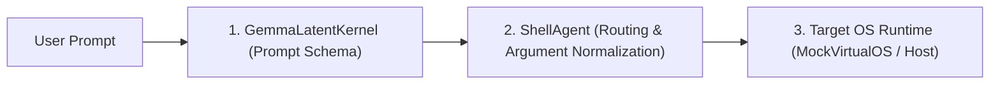

# How-To: Add a Custom Intent to AOS

This guide provides a step-by-step recipe for extending the Agentic Operating System with a new system capability or tool intent.

---

## Overview of the Intent Lifecycle

Every action performed by AOS follows a 3-tier boundary pipeline:



To add a new capability (for example, `SET_ALARM` or `EXECUTE_COMMAND`), you must update all three stages:
1. **Schema Declaration:** Add the intent type and payload definition to the system prompt in [`aos_kernel/inference.py`](https://github.com/MuzikayiseKhuzwayo/gemma4good/blob/main/aos_kernel/inference.py#L56-L66).
2. **Shell Agent Mapping:** Add dispatch logic in [`shell_agent/api_mapper.py`](https://github.com/MuzikayiseKhuzwayo/gemma4good/blob/main/shell_agent/api_mapper.py#L28-L52).
3. **Execution Runtime:** Implement the state mutation in [`mock_os/virtual_env.py`](https://github.com/MuzikayiseKhuzwayo/gemma4good/blob/main/mock_os/virtual_env.py) (and eventually host OS drivers).

---

## Step-by-Step Implementation Recipe

### Step 1: Declare the Intent in the Latent Kernel Prompt

Open [`aos_kernel/inference.py`](https://github.com/MuzikayiseKhuzwayo/gemma4good/blob/main/aos_kernel/inference.py) and update the `system_prompt` within `parse_intent`:

1. Add your new intent name to `Valid Intent Types`:
   ```python
   # Line ~56
   Valid Intent Types: WRITE_FILE, READ_FILE, DELETE_FILE, SEARCH_MEMORY, SEND_MESSAGE, NOTIFY_USER, ASK_USER_INPUT, SET_ALARM.
   ```
2. Define the expected JSON payload schema:
   ```python
   # Line ~66
   - SET_ALARM: {"time": "HH:MM", "label": "alarm description"}
   ```

### Step 2: Route the Intent in ShellAgent

Open [`shell_agent/api_mapper.py`](https://github.com/MuzikayiseKhuzwayo/gemma4good/blob/main/shell_agent/api_mapper.py) and add an `elif` branch in `_execute_virtual`:

```python
elif intent_type == "SET_ALARM":
    time_val = payload.get("time", "08:00")
    label_val = payload.get("label", "Default Alarm")
    return self.virtual_os.set_alarm(time_val, label_val)
```

### Step 3: Implement the Handler in MockVirtualOS

Open [`mock_os/virtual_env.py`](https://github.com/MuzikayiseKhuzwayo/gemma4good/blob/main/mock_os/virtual_env.py):

1. Initialize storage in `__init__`:
   ```python
   self.alarms = []
   ```
2. Implement the operational method:
   ```python
   def set_alarm(self, time_val, label):
       entry = {"time": time_val, "label": label, "status": "active"}
       self.alarms.append(entry)
       print(f"[VirtualOS] Alarm set for {time_val}: {label}")
       return entry
   ```
3. Expose state in `get_state_summary()`:
   ```python
   return {
       "files_in_system": list(self.file_system.keys()),
       "total_network_requests": len(self.network_logs),
       "total_notifications": len(self.notifications),
       "total_alarms": len(self.alarms)
   }
   ```

---

## Verification

Add a test case in [`test_all_intents.py`](https://github.com/MuzikayiseKhuzwayo/gemma4good/blob/main/test_all_intents.py):

```python
test_prompts.append("Wake me up at 7:00 AM for math class.")
```

Run the validation suite:
```bash
python test_all_intents.py
```

Verify that the output displays:
```text
[Latent Kernel Thought]: The user wants an alarm set at 7:00 AM.
Mapping intent to OS API calls: SET_ALARM
[VirtualOS] Alarm set for 07:00: math class
```
