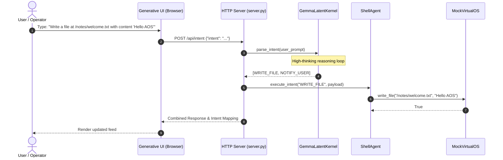

# Tutorial: Getting Started with Agentic OS (AOS)

This tutorial walks a new engineer or integrator through setting up and running the Agentic Operating System (AOS) locally in under 10 minutes.

---

## What You Will Build & Run

By the end of this tutorial, you will:
1. Configure your local environment with the required dependencies.
2. Launch the **AOS Web Interface** powered by the Latent Kernel.
3. State your first natural language intent and watch the Latent Kernel parse the intent, reason with `<thought_process>`, and execute operations against the sandbox.
4. Interact with the system via the headless CLI daemon.



---

## Prerequisites

* **Python:** 3.10, 3.11, 3.12, or 3.13.
* **Git:** Installed on your path.
* **Google Gemini API Key:** (Optional, for `google_genai` mode). If no key is provided, you can run in offline `mock` mode.

---

## Step 1: Clone and Set Up the Virtual Environment

Open your terminal or PowerShell and run:

```bash
# Clone the repository
git clone https://github.com/MuzikayiseKhuzwayo/gemma4good.git
cd gemma4good

# Create a virtual environment
python -m venv venv

# Activate the virtual environment
# Windows (PowerShell):
.\venv\Scripts\Activate.ps1
# Linux / macOS:
source venv/bin/activate

# Install dependencies
pip install -r requirements.txt
```

> [!NOTE]
> The dependencies defined in [`requirements.txt`](https://github.com/MuzikayiseKhuzwayo/gemma4good/blob/main/requirements.txt) include `google-genai`, `python-dotenv`, `requests`, and foundational machine learning libraries (`transformers`, `torch`, `accelerate`).

---

## Step 2: Configure Environment Variables

Create or inspect the `.env` file in the project root:

```ini
# .env
GEMINI_API_KEY=your_actual_gemini_api_key_here
```

If you do not have a Gemini API key yet, the kernel will display a warning and fall back to the built-in deterministic mock engine (`mode="mock"`), allowing you to test the architecture without an internet connection or API account.

---

## Step 3: Launch the Generative Web Interface

Launch the integrated HTTP server and local UI:

```bash
python server.py
```

Expected startup output:
```text
Booting Agentic OS Web Server...
Initializing Semantic File System (Vector DB Layer)
Booting Inference Kernel (Model: gemma-4-31b-it, Mode: google_genai)...
Using Google GenAI API for inference (No local download required).

Server running at http://127.0.0.1:8000
Open http://127.0.0.1:8000/index.html in your browser to view the interface.
```

1. Open your browser and navigate to `http://127.0.0.1:8000`.
2. Click the central orb or phone screen to enter the **Intent Interface**.
3. In the input box, type:
   ```text
   Write a file at /test/hello.txt with the content 'Welcome to Agentic OS'
   ```
4. Observe the response:
   * The Latent Kernel reasons about the input.
   * The Shell Agent maps the intent to `WRITE_FILE`.
   * The system confirms that the file was written to the sandbox.

---

## Step 4: Run in Headless CLI Mode

AOS also supports headless execution via the CLI daemon for terminal-only environments:

```bash
python main.py
```

You will enter the interactive prompt:
```text
AOS Daemon running. Entering Interactive Mode...
Type 'exit' or 'quit' to shutdown.

AOS> Send a message to Alice saying I will be late, and save a note.
```

The daemon will execute the ReAct loop, outputting kernel thoughts and simulated OS API execution steps directly to your terminal.

Type `exit` or `quit` to terminate the session.

---

## Next Steps

* Read the [Architecture Overview](https://github.com/MuzikayiseKhuzwayo/gemma4good/blob/main/docs/explanation/architecture.md) to understand the Latent Kernel paradigm.
* Learn [How to Add a Custom Intent](https://github.com/MuzikayiseKhuzwayo/gemma4good/blob/main/docs/how-to/add-custom-intent.md).
* Consult the [Intent Schemas Reference](https://github.com/MuzikayiseKhuzwayo/gemma4good/blob/main/docs/reference/intent-schemas.md).
